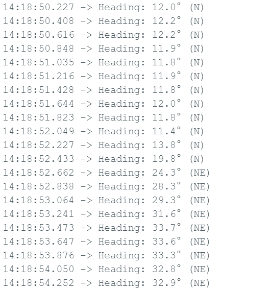

# PCBCUPID QMC6309 Magnetometer Library

An efficient Arduino-compatible library for the QMC6309 3-axis digital magnetometer sensor with accurate compass heading calculation, direction naming, and exponential smoothing filter for stable readings.

---

## Overview

The **PCBCUPID QMC6309** library offers an easy-to-use API to interface with the QMC6309 digital compass. Designed with accuracy and flexibility in mind, it supports:

* Chip ID verification
* Sensor reset and initialization sequence
* Calibrated heading output with direction name (e.g., N, NE, E...)
* Exponential smoothing filter for stable readings
* Offset calibration for hard iron correction

---

## Key Features

### Accurate Compass Output

* Calculates heading using `atan2(-x, y)` for natural compass alignment
* Converts raw magnetometer readings to degrees (0-360)
* Adjusts for magnetic declination
* Returns cardinal direction (N, NE, E, etc.)

### Calibration

* Offset-based hard iron calibration
* Offsets can be calculated once and passed to the library
* Avoids runtime recalibration inside loop

### Smoothing

* Optional exponential filter for smoothing noisy heading data
* Tunable smoothing factor `alpha`

### Platform Support

* ESP32, ESP32-H2, AVR Arduinos
* Uses standard `Wire` I2C interface

---

## Screenshot



---

## Installation

1. Copy the library folder into your Arduino `libraries/` directory.
2. Include the header in your sketch:

   ```cpp
   #include "PCBCUPID_QMC6309.h"
   ```
3. Optionally, include the smoothing filter:

   ```cpp
   #include "HeadingSmoother.h"
   ```

---

## Example

```cpp
#include <Wire.h>
#include "PCBCUPID_QMC6309.h"
#include "HeadingSmoother.h"

PCBCUPID_QMC6309 mag(Wire);
HeadingSmoother smoother(0.2);  // Smoothing factor 0.2

const float x_offset = 3485.0;
const float y_offset = 1290.0;
const float declination = 0.22;  //  declination in radians

void setup() {
  Serial.begin(115200);
  if (!mag.begin()) {
    Serial.println("Magnetometer init failed");
    while (1);
  }
  Serial.println("Heading Test Start");
}

void loop() {
  int16_t x, y, z;
  if (mag.readRaw(x, y, z)) {
    float x_cal = x - x_offset;
    float y_cal = y - y_offset;

    float heading = atan2(-x_cal, y_cal);
    heading += declination;
    if (heading < 0) heading += 2 * PI;
    if (heading > 2 * PI) heading -= 2 * PI;

    float headingDeg = heading * 180.0 / PI;
    float smooth = smoother.filter(headingDeg);

    Serial.print("Heading: ");
    Serial.print(smooth, 1);
    Serial.print("° (");
    Serial.print(mag.headingToDirection(smooth));
    Serial.println(")");
  }
  delay(200);
}
```

---

## API Reference

### Initialization

```cpp
bool begin();
```

Initializes the magnetometer with standard configuration.

### Raw Reading

```cpp
bool readRaw(int16_t &x, int16_t &y, int16_t &z);
```

Reads raw magnetometer values. Returns `false` if DRDY not set.

### Heading

```cpp
float getHeading();
const char* headingToDirection(float deg);
```

Returns heading angle (in degrees) and direction string (e.g., "NE").

### Calibration

```cpp
void setOffsets(int16_t x_off, int16_t y_off);
```

Applies hard iron calibration offsets.

### Convert to microTesla

```cpp
void convertToMicroTesla(int16_t xRaw, int16_t yRaw, int16_t zRaw,
                         float &x_uT, float &y_uT, float &z_uT);
```

Converts raw data to microTesla using scale factor for 8G range.

### Debug Utilities

```cpp
void dumpRegisters();
```

Prints all register values for debugging.

---

## Smoothing Filter (`HeadingSmoother.h`)

```cpp
class HeadingSmoother {
public:
  HeadingSmoother(float alpha);
  float filter(float newValue);
  void setAlpha(float newAlpha);
  float getValue() const;
};
```

Applies exponential smoothing to heading.

---

## License

This project is licensed under the **MIT License**. See `LICENSE` for details.

---

## Author

**Karthik Elumalai** – @PCBCUPID
Version: 1.0.0

**Made with ❤️ by PCBCUPID Technologies**
